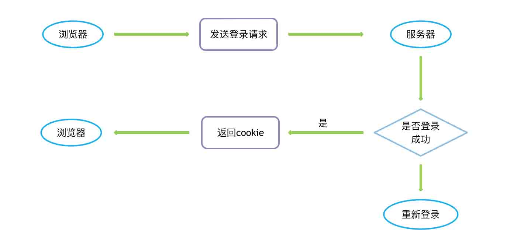

# 第五章 Cookie跟session

## 6.1 cookie
1. 在上节课，我们简单了解了登录过程，但是很明显，每次都需要登录，但是在平常逛网站的只需要登录一次，那么网站是如何记录登录信息的呢？
2. 有没有什么办法可以让浏览器记住登录信息，下次再次打开的时候，可以自动登录呢？

### 6.1.1 set_cookie 设置
1. expires:设置过期时间为60秒
2. path:设置路径
3. httponly:设置 js 不可以获取cookie
4. max_age:max_age 优先级高

cookie实例
```
import tornado.web
import time
from model.model import User

class SetHandler(tornado.web.RequestHandler):
    def get(self):
        self.set_cookie('cookie_1', 'this_is_test')
        self.set_cookie('cookie_2', 'this_is_test', expires= time.time() + 30 ) # 为cookie设置一个过期时间
        self.set_cookie('cookie_3', 'this_is_test',expires_days= 1) # 为cookie设置1天过期
        self.set_cookie('cookie_4', 'this_is_test',path='/') # 为cookie设置路径
        self.set_cookie('cookie_5', 'this_is_test', httponly=True) # 设置 js 不可以获取cookie
        self.set_cookie('cookie_6', 'this_is_test', max_age=120,expires=time.time()+ 30) #设置cookie过期时间，max_age优先级高
        self.set_secure_cookie('cookie_7','this_is_test') # 设置加密cookie
        self.write('这是一个cookie信息')
```

### 6.1.2 set_secure_cookie 设置加密cookie
需要设置 application 的 cookie_secret 参数
```
import tornado.ioloop
import tornado.web
import tornado.httpserver

from tornado.options import define,options

define('port', default=8080, help='run port', type=int)

from handlers.main import LoginHandler, SetHandler

app = tornado.web.Application(
    cookie_secret ='jiamiacookieyan', # 设置加密cookie配置
)

if __name__ == "__main__":
    http_server = tornado.httpserver.HTTPServer(app)
    http_server.listen(options.port)
    tornado.ioloop.IOLoop.current().start()
```

### 6.1.3 获取一个cookie
 ```
import tornado.web
import time
from model.model import User

class GetHandler(tornado.web.RequestHandler):
    def get(self):
        print(self.get_cookie('cookie_5')) # 获取普通cookie
        print(self.get_secure_cookie('cookie_7')) # 获取加密cookie
 ```

### 6.1.4 cookie总结
1. cookie概念:清楚cookie的概念和作用
2. cookie设置:掌握 cookie 的设置方法

## 6.2 登录验证
继续回到上个问题，我们希望用户只需要在第一次登录的时候输入用户名和密码，之后可以自动登录，不需要再次输入用户名和密码，也就是说在用户第二次访问的时候，服务器能够自动的验证用户登录信息，那么如何实现自动验证的功能呢？

### 6.2.1 导入装饰器
```
from ftornado.web import RequestHandler, authenticated
```

### 6.2.2 声明BaseHandler
```
# 重写get_current_user功能
class BaseHandler(RequestHandler):
    def get_current_user(self):
        current_user = self.get_secure_cookie('ID') # 设置加密cookie
        if current_user:
            return current_user
        return None
```

### 6.2.3 配置登录路由
```
app = tornado.web.Application(
    login_url = '/login',
)
```

### 6.2.4 装饰需要验证的请求
```
class BuyHandler(BaseHandler): # 继承BaseHandler
    # 验证用户是否登录
    @authenticated # 在不改变原方法的基础上给他加一个登录验证功能
    def get(self):
        self.write('Leva 买买买')
```

### 6.2.5 登录模块
```
class LoginHandler(BaseHandler):
    def get(self):
        self.render('login.html')

    def post(self):
        user = self.get_argument('name',None)
        username = User.by_name(user)
        passwd = self.get_argument('password',None)

        if username and passwd == username[0].password:
            self.write('登录成功')
        else:
            self.write('用户名或密码错误')
            self.render('login.html')
```

### 6.2.6 登录模板
```
<form method="post" action="/login" >
    <p>用户名<br>
        <input type="text" name="name">
    </p>
    <p>密码<br>
        <input type="password" name="password">
    </p>
    <input type="submit">
</form>
```

### 6.2.7 获取之前路由
URL`http://127.0.0.1:8080/login?next=%2Fbuy` 获取next参数数据方法如下
```
class LoginHandler(BaseHandler):
    def get(self):
        nextname = self.get_argument('next',None) # 获取url地址内参数数据
        self.render('login.html',nextname=nextname)
```
在使用 authenticated 之后，如果验证不成功，会自动跳转到登录路由，并且在 URL 后面加上 next 参数，next 参数的参数值就是之前的路由

### 6.2.8 修改模板文件
修改前:`<form method="post" action="/login" >`

修改后:`<form method="post" action="/login?next={{ nextname }}" >`

在模板中添加 next 参数，并且参数值为之前的路由

### 6.2.9 修改登录post方法
```
class LoginHandler(BaseHandler):
    def get(self):
        nextname = self.get_argument('next',None) # 获取url地址内参数数据
        self.render('login.html',nextname=nextname)

    def post(self):
        nextname = self.get_argument('next',None) # 获取url地址内参数数据
        user = self.get_argument('name',None)
        username = User.by_name(user)
        passwd = self.get_argument('password',None)

        if username and passwd == username[0].password:
            self.set_secure_cookie('ID',user)
            self.redirect(nextname) # 跳转路由
        else:
            self.write('用户名或密码错误')
            self.render('login.html',nextname=None)
```
1. 获取之前的页面的路由
2. 当登录验证通过之后，设置加密的 cookie ，并跳转到之前的路由

### 6.2.10 登录验证总结
1. authenticated: 掌握 authenticated 的使用
2. 跳转到之前页面: 跳转到之前页面的方法

### 6.2.11 简单登录验证案例
简单登录总目录
```
cookie                # 项目总目录
├── app.py            # 项目总入口
├── handlers          # 项目总路由目录
│   └── main.py       # 路由总函数入口 
├── model             # 数据库模型总目录
│   ├── connect.py    # SQLAlchemy连接入口
│   └── model.py      # SQLAlchemy数据模型
└── templates         # 项目模板总目录
    ├── __init__.py
    ├── base.html     # 父模板文件
    ├── login.html    # 登录模板
    └── vip.html      # 会员详情模板

```
app.py
```
import tornado.ioloop
import tornado.web
import tornado.httpserver

from tornado.options import define,options

define('port', default=8080, help='run port', type=int)

from handlers.main import LoginHandler, BuyHandler, VipHandler

app = tornado.web.Application(
    handlers = [
        (r'/login', LoginHandler),
        (r'/buy', BuyHandler),
        (r'/vip', VipHandler)

    ],
    template_path = 'templates',
    static_path = 'static',
    debug = True,
    cookie_secret ='jiamiacookieyan',
    login_url = '/login',
    pycket = {
        'engine':'redis',
        'storage':{
            'host':'localhost',
            'port':'6379',
            'db_sessions':5, # 指定redis数据库内第几个库
            'db_notifications':11,
            'max_connections':2**31 #最大连接数
        },
        'cookies':{
            'expires_days':30, # 设置cookie 30天过期
            'max_age':100
        },
    },
)

if __name__ == "__main__":
    http_server = tornado.httpserver.HTTPServer(app)
    http_server.listen(options.port)
    tornado.ioloop.IOLoop.current().start()
```
 main.py
 ```
from tornado.web import RequestHandler, authenticated
from model.model import User
from pycket.session import SessionMixin

class BaseHandler(RequestHandler,SessionMixin):
    def get_current_user(self):
        current_user = self.get_secure_cookie('ID') 
        if current_user:
            return current_user
        return None

class BuyHandler(BaseHandler):
    # 验证用户是否登录
    @authenticated # 在不改变原方法的基础上给他加一个登录验证功能
    def get(self):
        self.write('Leva 买买买')

class VipHandler(BaseHandler):
    @authenticated
    def get(self):
        self.render('vip.html')

    def post(self):
        pass

class LoginHandler(BaseHandler):
    def get(self):
        nextname = self.get_argument('next','')
        self.render('login.html',nextname=nextname)

    def post(self):
        nextname = self.get_argument('next','')
        print(nextname)
        user = self.get_argument('name',None)
        username = User.by_name(user)
        passwd = self.get_argument('password',None)

        if username and passwd == username[0].password:
            self.set_secure_cookie('ID',user)

            if nextname == '':
                self.redirect('/vip')
            else:
                self.redirect(nextname) # 跳转路由
        else:
            self.write('用户名或密码错误')
            self.render('login.html',nextname=None)
 ```
 connect.py
 ```
from sqlalchemy import create_engine
from sqlalchemy.ext.declarative import declarative_base
from sqlalchemy.orm import sessionmaker

HOSTNAME = '127.0.0.1'
PORT = '3306'
DATABASE = 'orm_sql'
USERNAME = 'leva'
PASSWORD = 'leva123'

DB_url = 'mysql+pymysql://{}:{}@{}:{}/{}?charset=utf8'.format(
    USERNAME,
    PASSWORD,
    HOSTNAME,
    PORT,
    DATABASE
)

engine = create_engine(DB_url) #连接数据库

Base = declarative_base(engine) # 这个Base类就是基类

Session = sessionmaker(engine) #赋值一个Session
session = Session() #实例化

if __name__== '__main__':
    connection = engine.connect()
    result = connection.execute('select 1')
    print(result)
 ```
 model.py
```
 from model.connect import Base
from model.connect import session
from datetime import datetime
from sqlalchemy import Column, Integer, String, Boolean, DateTime

class User(Base):
    """建立数据库模型对应User表"""
    __tablename__ = 'user'
    id = Column(Integer,primary_key=True,autoincrement=True)
    username = Column(String(20))
    password = Column(String(20))
    creat_time = Column(DateTime,default=datetime.now())
    _locked = Column(Boolean,default=False,nullable=False)

    def __repr__(self):
        return '<User(id=%s),username=%s,password=%s,creat_time=%s,_locked=%s>' %(
            self.id,
            self.username,
            self.password,
            self.creat_time,
            self._locked,
        )
    @classmethod
    def by_name(cls,name):
        return session.query(cls).filter_by(username=name).all()
```
base.html
```
<!DOCTYPE html>
<html lang="en">
<head>
    <meta charset="UTF-8">
    <title>Templates </title>
    <link rel="shortcut icon" href="{{ static_url('images/favicon.ico')}}">
</head>
<body>

变异内容

</body>
</html>
```
login.html
```



登录页面



<form method="post" action="/login?next={{ nextname }}" >
    <p>用户名<br><input type="text" name="name"></p>
    <p>密码<br><input type="password" name="password"></p>
    <input type="submit">
</form>

```
vip.html
```



会员详情页




会员ID:<br>
会员密码:<br>


```

## 6.3 session
通过刚才的学习，可以用了解到 cookie 中的信息可以用来保存用户的登录信息，但是coolkie 是很容易被拦截的，所以其中必定不能有用户的任何私密信息，那么又有什么办法可以让服务器保存用户的登录信息，但是cookie中又不会有用户的任何信息呢？
### 6.3.1 安装模块
1. pycket: `pip install pychet` session模块
2. redis: `pip install redis` redis数据库模块

### 6.3.2 导入SessionMixin模块
```
from pycket.session import SessionMixin
```

### 6.3.3 继承SessionMixin模块
```
class BaseHandler(RequestHandler,SessionMixin): # 继承SessionMixin
    def get_current_user(self):
        current_user = self.get_secure_cookie('ID')
        if current_user:
            return current_user
        return None
```

### 6.3.4 在application中配置
1. 配置 redis 的相关信息
2. 配置 cookie 的过期时间
```
app = tornado.web.Application(
    login_url = '/login', # 登录验证路由url
    # session验证
    pycket = {                 
        'engine':'redis',
        'storage':{
            'host':'localhost',
            'port':'6379',
            'db_sessions':5, # 指定redis数据库内第几个库
            'db_notifications':11,
            'max_connections':2**31 #最大连接数
        },
        'cookies':{
            'expires_days':30, # 设置cookie 30天过期
            'max_age':100
        },
    },
)
```

### 6.3.5 改设置cookie为设置session
```
class BaseHandler(RequestHandler,SessionMixin):
    def get_current_user(self):
        # current_user = self.get_secure_cookie('ID') #current_user=self.session.get('user')
        current_user = self.session.get('user') # 包含cookie的session
        if current_user:
            return current_user
        return None
```
### 6.3.6 改获取cookie为获取session
```
class LoginHandler(BaseHandler):
    def get(self):
        nextname = self.get_argument('next','')
        self.render('login.html',nextname=nextname,User =None)

    def post(self):
        nextname = self.get_argument('next','')
        print(nextname)
        user = self.get_argument('name',None)
        username = User.by_name(user)
        passwd = self.get_argument('password',None)

        if username and passwd == username[0].password:
            # self.set_secure_cookie('ID',user) # 改为self.session.set('user',username[0].username)
            self.session.set('user',username[0].username) # 包含cookie的session

            if nextname == '':
                self.redirect('/vip')
            else:
                self.redirect(nextname) # 跳转路由
        else:
            self.write('用户名或密码错误')
            self.render('login.html',nextname=None, User= None)
```

### 6.3.7 session总结
1. session : session的使用方法
2. session : session把用户信息存放在redis数据库中，cookie中存放没有任何意义的键值，保证用户信息不被轻易泄漏

### 6.3.8 session登录验证案例
session登录验证案例目录
```
cookie                # 项目总目录
├── app.py            # 项目总入口
├── handlers          # 项目总路由目录
│   └── main.py       # 路由总函数入口 
├── model             # 数据库模型总目录
│   ├── connect.py    # SQLAlchemy连接入口
│   └── model.py      # SQLAlchemy数据模型
└── templates         # 项目模板总目录
    ├── __init__.py
    ├── base.html     # 父模板文件
    ├── login.html    # 登录模板
    └── vip.html      # 会员详情模板

```
app.py
```
import tornado.ioloop
import tornado.web
import tornado.httpserver

from tornado.options import define,options

define('port', default=8080, help='run port', type=int)

from handlers.main import LoginHandler, BuyHandler, VipHandler

app = tornado.web.Application(
    handlers = [
        (r'/login', LoginHandler),
        (r'/buy', BuyHandler),
        (r'/vip', VipHandler)

    ],
    template_path = 'templates',
    static_path = 'static',
    debug = True,
    cookie_secret ='jiamiacookieyan',
    login_url = '/login',
    pycket = {
        'engine':'redis',
        'storage':{
            'host':'localhost',
            'port':'6379',
            'db_sessions':5, # 指定redis数据库内第几个库
            'db_notifications':11,
            'max_connections':2**31 #最大连接数
        },
        'cookies':{
            'expires_days':30, # 设置cookie 30天过期
            'max_age':100
        },
    },
)

if __name__ == "__main__":
    http_server = tornado.httpserver.HTTPServer(app)
    http_server.listen(options.port)
    tornado.ioloop.IOLoop.current().start()
```
 main.py
 ```
from tornado.web import RequestHandler, authenticated
from model.model import User
from pycket.session import SessionMixin

class BaseHandler(RequestHandler,SessionMixin):
    def get_current_user(self):
        # current_user = self.get_secure_cookie('ID') #current_user=self.session.get('user')
        current_user = self.session.get('user') # 包含cookie的session
        if current_user:
            return current_user
        return None

class BuyHandler(BaseHandler):
    # 验证用户是否登录
    @authenticated # 在不改变原方法的基础上给他加一个登录验证功能
    def get(self):
        self.write('Leva 买买买')

class VipHandler(BaseHandler):
    @authenticated
    def get(self):
        self.render('vip.html')

    def post(self):
        pass

class LoginHandler(BaseHandler):
    def get(self):
        nextname = self.get_argument('next','')
        self.render('login.html',nextname=nextname)

    def post(self):
        nextname = self.get_argument('next','')
        print(nextname)
        user = self.get_argument('name',None)
        username = User.by_name(user)
        passwd = self.get_argument('password',None)


        if username and passwd == username[0].password:
            # self.set_secure_cookie('ID',user) # 改为self.session.set('user',username[0].username)
            self.session.set('user',username[0].username) # 包含cookie的session


            if nextname == '':
                self.redirect('/vip')
            else:
                self.redirect(nextname) # 跳转路由
        else:
            self.write('用户名或密码错误')
            self.render('login.html',nextname=None)
 ```
 connect.py
 ```
from sqlalchemy import create_engine
from sqlalchemy.ext.declarative import declarative_base
from sqlalchemy.orm import sessionmaker

HOSTNAME = '127.0.0.1'
PORT = '3306'
DATABASE = 'orm_sql'
USERNAME = 'leva'
PASSWORD = 'leva123'

DB_url = 'mysql+pymysql://{}:{}@{}:{}/{}?charset=utf8'.format(
    USERNAME,
    PASSWORD,
    HOSTNAME,
    PORT,
    DATABASE
)

engine = create_engine(DB_url) #连接数据库

Base = declarative_base(engine) # 这个Base类就是基类

Session = sessionmaker(engine) #赋值一个Session
session = Session() #实例化

if __name__== '__main__':
    connection = engine.connect()
    result = connection.execute('select 1')
    print(result)
 ```
 model.py
```
 from model.connect import Base
from model.connect import session
from datetime import datetime
from sqlalchemy import Column, Integer, String, Boolean, DateTime

class User(Base):
    """建立数据库模型对应User表"""
    __tablename__ = 'user'
    id = Column(Integer,primary_key=True,autoincrement=True)
    username = Column(String(20))
    password = Column(String(20))
    creat_time = Column(DateTime,default=datetime.now())
    _locked = Column(Boolean,default=False,nullable=False)

    def __repr__(self):
        return '<User(id=%s),username=%s,password=%s,creat_time=%s,_locked=%s>' %(
            self.id,
            self.username,
            self.password,
            self.creat_time,
            self._locked,
        )
    @classmethod
    def by_name(cls,name):
        return session.query(cls).filter_by(username=name).all()
```
base.html
```
<!DOCTYPE html>
<html lang="en">
<head>
    <meta charset="UTF-8">
    <title>Templates </title>
    <link rel="shortcut icon" href="{{ static_url('images/favicon.ico')}}">
</head>
<body>

变异内容

</body>
</html>
```
login.html
```



登录页面



<form method="post" action="/login?next={{ nextname }}" >
    <p>用户名<br><input type="text" name="name"></p>
    <p>密码<br><input type="password" name="password"></p>
    <input type="submit">
</form>

```
vip.html
```



会员详情页




会员ID:<br>
会员密码:<br>


```

## 6.4 XSRF
使用session可以保证用户信息不被cookie泄漏，那如果如果攻击者不想获取用户信息，只是在提交 form 表单时攻击，该怎么防范呢？

### 6.4.1 模板添加
```

```
Tornado 有内建的 XSRF 的防范机制，要使用此机制，只需要在模板中添加如上代码

### 6.4.2 XSRF 总结
1. XSFR: Tornado中XSRF的防范方法
2. XSFR: XSRF的防范原理

### 6.4.3 XSRF 案例
```



登录页面




<form method="post" action="/login?next={{ nextname }}" >
    <p>用户名<br><input type="text" name="name"></p>
    <p>密码<br><input type="password" name="password"></p>
    <input type="submit">
</form>

```
通过查看cookie会有一个`_xsrf`的cookie
