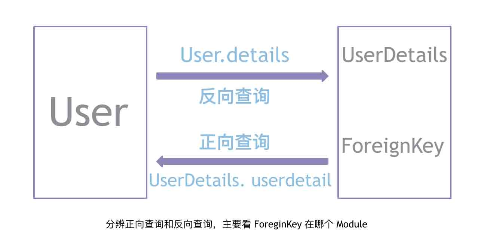

# 第四章 SQLAlchemy

## 1 ORM
**ORM全称 Object Relational Mapping对象关系映射**

通过 ORM 可以不用关心后台是使用的哪种数据库，只需要按照 ORM 所提供的语法规则去书写相应的代码， ORM 就会自动的转换成对应对应数据库的 SQL 语句

## 2 SQLAIchemy连接数据库
### 2.1 安装
#### 2.1.1 安装mysql
Mysql安装教程连接:
#### 2.1.2 安装python包`pymysql`、`sqlalchemy`
1. pymysql安装:`pip install pymysql`
2. sqlalchemy安装:`pip install sqlalchemy`

#### 2.2 导入create_engine模块
db.py代码
```
from sqlalchemy import create_engine
```

#### 2.3  数据库连接配置

```
HOSTNAME = '127.0.0.1'
PORT = '3306'
DATABASE = 'mysql'
USERNAME = 'leva'
PASSWORD = 'leva123'
```

#### 2.4 数据库连接URL
```
# 第一种数据库连接
DB_url = 'mysql+pymysql://%s:%s@%s:%s/%s?charset=utf8' %(
    USERNAME,
    PASSWORD,
    HOSTNAME,
    PORT,
    DATABASE
)

# 第二种数据库连接 
DB_url = 'mysql+pymysql://{}:{}@{}:{}/{}?charset=utf8'.format(
    USERNAME,
    PASSWORD,
    HOSTNAME,
    PORT,
    DATABASE
)
```

#### 2.5 数据库连接
```
engine = create_engine(DB_url)
```

#### 2.6 测试数据库
```
if __name__== '__main__':
    connection = engine.connect()
    result = connection.execute('select 1')
    print(result)
```
#### 2.7 创建一个基类
```
from sqlalchemy.ext.declarative import declarative_base
Base = declarative_base(engine)
```
1. 对象关系型映射，数据库中的表与python中的类相对应，创建的类必须继承自 sqlalchemy 中的基类。
2. 使用 declarative 方法定义的映射类依据一个基类，这个基类是维系类和数据表关系的目录。
3. 应用通常只需要有一个 Base 的实例。我们通过 declarative_base() 功能创建一个基类。
```
from sqlalchemy import create_engine #create_engine模块
from sqlalchemy.ext.declarative import declarative_base #导入一个基类模块

HOSTNAME = '127.0.0.1'
PORT = '3306'
DATABASE = 'mydb'
USERNAME = 'leva'
PASSWORD = 'leva123'

DB_url = 'mysql+pymysql://{}:{}@{}:{}/{}?charset=utf8'.format(
    USERNAME,
    PASSWORD,
    HOSTNAME,
    PORT,
    DATABASE
)

engine = create_engine(DB_url)

Base = declarative_base(engine) # 这个Base类就是基类
```

## 3 Module
**通过SQLALchemy提供的语法来声明表**
1. __ tablename__ : 数据库中表名
2. Column: 用来创建表中的字段的一个方法
3. Integer: 整型，映射到数据库中的类型
4. String: 字符类型，映射到数据库中的类型，使用时，需要提供一个字符长度
5. DateTime:  时间类型

### 3.1 创建数据库模型
```
from connect import Base
from datetime import datetime
from sqlalchemy import Column, Integer, String, Boolean, DateTime
```

1. 再次强调，我们用类来表示数据库里面的表！！！
2. 这些表的类都继承于我们的Base基类。
3. 在类里面我们定义一些属性，这个属性通过映射，就对应表里面的字段
user_modules.py代码
```
from connect import Base
from datetime import datetime
from sqlalchemy import Column, Integer, String, Boolean, DateTime

class User(Base):
    """建立数据库模型对应User表"""
    __tablename__ = 'user'
    id = Column(Integer,primary_key=True,autoincrement=True)
    username = Column(String(20))
    password = Column(String(20))
    creat_time = Column(DateTime,default=datetime.now())
    _locked = Column(Boolean,default=False,nullable=False)

if __name__ == "__main__":
    Base.metadata.create_all() #执行此代码，就会把创建好的 Module 映射到数据库中
```

## 4 增删改查

### 4.1 创建会话
在对表数据进行增删改查之前，先需要建立会话，建立会话之后才能进行操作，就类似于文件要打开之后才能对文件内容操作
connect.py添加如下代码
```
from sqlalchemy.orm import sessionmaker #导入sessionmaker

Session = sessionmaker(engine) #创建一个session会话
session = Session() #实例化session
```
### 4.2 简单增删改查

#### 4.2.1 添加单条数据
```
from connect import session
from user_modules import User

def add_user():
    """添加数据"""
    """添加单条数据方法"""
    person = User(username='Leva',password='123')
    session.add(person)
    session.commit() #提交事务

if  __name__ == "__main__":
    add_user()
```

#### 4.2.2 添加多条数据
```
from connect import session
from user_modules import User

def add_user():
    """添加数据"""
    """添加多条数据方法"""
        session.add_all([
        User(username='zlk',password='123'),
        User(username='rave',password='123'),
    ])
    session.commit() #提交事务

if  __name__ == "__main__":
    add_user()
```

#### 4.2.3 数据模型显示格式
test_user_modules.py代码
```
from connect import Base
from datetime import datetime
from sqlalchemy import Column, Integer, String, Boolean, DateTime

class User(Base):
    """建立数据库模型对应User表"""
    __tablename__ = 'user'
    id = Column(Integer,primary_key=True,autoincrement=True)
    username = Column(String(20))
    password = Column(String(20))
    creat_time = Column(DateTime,default=datetime.now())
    _locked = Column(Boolean,default=False,nullable=False)

    def __repr__(self): #数据模型显示样式设置
        return"""
            <User(id=%s),username=%s,password=%s,creat_time=%s,_locked=%s>
        """ %(
            self.id,
            self.username,
            self.password,
            self.creat_time,
            self._locked,
        )

```

#### 4.2.4 查询第一条数据
```
from connect import session
from user_modules import User

def search_user():
    """查询数据"""
    rows = session.query(User).first() #查询所有数据库
    print(rows)

if  __name__ == "__main__":
    search_user()
```

#### 4.2.5 查询所有数据
```
from connect import session
from user_modules import User

def search_user():
    """查询数据"""
    rows = session.query(User).all() #查询所有数据库
    print(rows)

if  __name__ == "__main__":
    search_user()
```

#### 4.2.6 更新数据
```
from connect import session
from user_modules import User

def update_user():
    #查询出用户名为Leva，然后update把数据的密码进行更新。
    session.query(User).filter(User.username =="Leva").update({User.password:1})
    session.commit()

if  __name__ == "__main__":
    update_user()
```

#### 4.2.7 删除数据
```
from connect import session
from user_modules import User

def delete_user():
    rows = session.query(User).filter(User.username=='Leva')[0]
    session.delete(rows)
    session.commit()

if  __name__ == "__main__":
    delete_user()
```

## 5 查询结果

### 5.1 
```
from connect import session
from user_modules import User
```

### 5.2 query返回对象
使用 SQLAlchemy 时，如果想要查看最终在数据库中执行的 sql ，可以通过以下方式来查看
```
rs = session.query(User).filter(User.username=='zlk')
print(rs,type(rs))
```
根据返回结果来看， rs  是一个 Query 对象，打印出来可以看到转化的 SQL

#### 5.2.1 all
all 是返回所有符合条件的数据
```
rs = session.query(User).filter(User.username=='zlk').all()
```
这里，在 query 中查询对象的某个属性值 ( 对应为查询表中某个字段的值 )，返回的结果不再是一个 Query 对象，而是一个列表
```
session.query(User.username).filter(User.username=='zlk').all()
```

#### 5.2.2 first
first 是返回所有符合条件数据的第一条数据
```
rs = session.query(User).filter(User.username=='zlk').first()
```
同理，但是 first 返回结果是一个元组
```
session.query(User.username).filter(User.username=='zlk').first()
```

#### 5.2.3 [0]
[0] 和 first 类似，但是如果没有符合条件的数据则会报错
```
rs = session.query(User).filter(User.username=='zlk')[0]
```
[0] 和 first 类似，但是如果没有符合条件的数据则会报错
```
session.query(User.username).filter(User.username=='zlk')[0]
```
#### 5.2.4 取值方式
getattr(rs[0], 'username'),  rs[0].username 这两种方式可以取到具体的数据值
```
rs = session.query(User).filter(User.username=='zlk').all()
```

### 5.5.3 查询结果总结
1. 《返回对象》必须掌握：不同查询方式，返回对象的区别。如果是整表查询则返回Module的一个实例；如果是查询某个属性，返回的则是具体的数据
2. 《返回结果取值》必须掌握：不同的返回结果，取值方式也会有所区别，如果是 Module 实例，需要通过属性访问的方式取值，同时也要注意 all 和 first 返回的结果的区别

## 6 条件查询
在实际的工作中，查询的时候会有很多的要求，通过不同的条件筛选出精准的数据，那在SQLAlchemy中该如何进行条件查询呢？

### 6.1 过滤函数

#### 6.1.1 filter
filter 是一个**过滤函数**，过滤条件都可以书写在此函数中，不同的条件之间用 **逗号** 分隔
```
session.query(User).filter(User.username == 'zlk').all()
```

#### 6.1.2 filter_by
filter_by 也是一个过滤函数，但是功能要弱一些
```
session.query(User).filter_by(username = 'zlk').all()
```

#### 6.1.3 filter 和 filter_by 的区别
**二者都是 过滤函数，但是使用有如下差别：**
1. `filter` 中需要添加 类对象，filter_by不需要
2. `filter_by` 中只能添加等于的条件，不能添加 不等于、大于小于等条件，filter没有这个限制

### 6.2 模糊查询

#### 6.2.1 like 和 notlike
1. `like` 是模糊查询，和数据库中的 like 用法一样
2. `notlike` 和 `like` 作用相反
```
session.query(User.id).filter(User.username.like('zlk')).all()

session.query(User.id).filter(User.username.notlike('zlk')).all()
```

#### 6.2.3 in_ 和 notin_
in_  和 notin_  是范围查找
```
session.query(User.id).filter(User.username.in_(['zlk','tuple'])).all()

session.query(User.id).filter(User.username.notin_(['zlk','tuple'])).all()
```

#### 6.2.4 is_ 和 isnot
is_  和 isnot  精确查找  
```
session.query(User.id).filter(User.username.is_(None)).all()

session.query(User.id).filter(User.username.isnot(None))).all()

# 判断为空还可以使用：
session.query(User.id).filter(User.username == None).all()
```


### 6.3 查询结果数

#### 6.3.1 all
先用 all 查看所有的数据
```
session.query(User.username).filter(User.username != 'zlk').all()
```

#### 6.3.2 limit
limit  查看前两条数据
```
session.query(User.username).filter(User.username != 'zlk').limit(2).all()
```

#### 6.3.3 offset
offset  偏移一条记录
```
session.query(User.username).filter(User.username != 'zlk').offset(1).all()
```

#### 6.3.4 slice
slice 对查询出来的数据进行切片取值
```
session.query(User.username).filter(User.username != 'zlk').slice(1,3).all()
```

#### 6.3.5 one
one  查询一条数据，如果存在多条则报错   
```
session.query(User.username).filter(User.username != 'zlk').one()
```


### 6.4 排序
```
from sqlalchemy import desc
```

#### 6.4.1 order_by
order_by 对查询出来的结果进行排序，默认是顺序
```
session.query(User.username).filter(User.username != 'zlk').order_by(User.id).all()
```

#### 6.4.2 desc
desc 是倒序排序
```
session.query(User.username).filter(User.username != 'zlk').order_by(desc(User.username)).all()
```

#### 6.4.3 order_by 和 limit
order_by  和 limit 一起使用的时候，可以通过如下方式
```
session.query(User.username).filter(User.username != 'zlk').order_by(User.username)limit(3).all()
```

### 6.5 函数
导入 func，extract
```
from sqlalchemy import func, extract
```

#### 6.5.1 func.count
使用函数时，需要导入 func， group_by 和 order_by 一样，是可以直接使用的，不需要导入 
```
session.query(User.password,func.count(User.id)).group_by(User.password).all()
```

#### 6.5.2 having
having 也可以直接使用，使用方法也和 SQL 中使用类似
```
session.query(User.password,func.count(User.id)).group_by(User.password).having(func.count(User.id)>1).all()
```

### 6.6 聚合函数

#### 6.6.1 func.sum
sum求和
```
session.query(User.password, func.sum(User.id)).group_by(User.password).all()
```

#### 6.6.2 func.max
max 求最大值
```
session.query(User.password,func.max(User.id)).group_by(User.password).all()
```

#### 6.6.3 func.min
min 求最大值
```
session.query(User.password,func.min(User.id)).group_by(User.password).all()
```

#### 6.6.4 extract 函数
`extract` 提取对象中的数据，这里提取分钟，并把提取出来的结果用 `label`命名别名，之后就可以使用 `group_by` 来分组
```
session.query(extract('minute',User.creatime).labe('minute'),func.count(User.id)).group_by('minute').all()
```
count 里面同样可以使用 * 

这里只是给出一个演示实例，如果在今后需要使用其他的函数，导入即可
```
session.query(extract('day',creatime).label('day'),func.count('*')).group_by('day').all()
```

### 6.7 选择条件

#### 6.7.1 or_
or_  是或者的意思，和数据库中的 or 一样
```
from sqlalchemy import or_

session.query(User.username).filter(or_(User.username.isnot(None),User.password == '123')).all()
```

### 6.8 查询总结
1. 《过滤函数》必须掌握:两个过滤函数的用法和区别  
2. 《函数》必须掌握:使用函数的方法
3. 《模糊查询》必须掌握:常见的模糊查询方法
4. 《排序》必须掌握:排序方法和分组等方法

## 7 多表查询
在刚才演示了查询中的常用方法，但是都是一张表去查询，实际工作中经常会要多个表来查询，这种情况改怎么做呢？
### 7.1 新建Module
user_modules.py
```
from connect import Base
from datetime import datetime
from sqlalchemy import Column, Integer, String, Boolean, DateTime,ForeignKey

class User(Base):
    """建立数据库模型对应User表"""
    __tablename__ = 'user'
    id = Column(Integer,primary_key=True,autoincrement=True)
    username = Column(String(20))
    password = Column(String(20))
    creat_time = Column(DateTime,default=datetime.now())
    _locked = Column(Boolean,default=False,nullable=False)

    def __repr__(self):
        return '<User(id=%s),username=%s,password=%s,creat_time=%s,_locked=%s>' %(
            self.id,
            self.username,
            self.password,
            self.creat_time,
            self._locked,
        )

class UserDetails(Base):
    __tablename__ = 'user_details'
    id = Column(Integer, primary_key=True, autoincrement=True)
    id_card = Column(Integer, nullable=True, unique=True)
    lost_login = Column(DateTime)
    login_num = Column(Integer,default=0)
    user_id = Column(Integer,ForeignKey('user.id'))

    def __repr__(self):
        return '<UserDetails(id=%s,id_card=%s,lost_login=%s,login_num=%s,user_id=%s)>'%(
            self.id,
            self.id_card,
            self.login_num,
            self.lost_login,
            self.user_id
        )

if __name__ == "__main__":
    Base.metadata.create_all()
```

### 7.2 导入UserDetails
```
from user_modules import UserDetails
```

#### 7.2.1 cross join
`session.query(UserDetails,User)`通过打印的 SQL 来看，这种是 cross join

```
示例
session.query(UserDetails,User).filter(UserDetails.id==User.id).all()
```

#### 7.2.2 inner join
通过打印的 SQL 来看，下面这种方式是 inner join
```
session.query(User.username,UserDetails.lost_login).join(UserDetails,UserDetails.id == User.id)

# 示例
session.query(User.username,UserDetails.lost_login).join(UserDetails,UserDetails.id == User.id).all()
```

#### 7.2.3 left join
通过上面打印的  SQL 来看， 下面这种方式采用的是left join
```
session.query(User.username,UserDetails.lost_login).outerjoin(UserDetails,UserDetails.id == User.id)
 
#示例
session.query(User.username,UserDetails.lost_login).outerjoin(UserDetails,UserDetails.id == User.id).all()
```

#### 7.2.4 union
union 是联合查询，有自动去重的功能，对应的还有 union_all
```
q1 = session.query(User.id)
q2 = session.query(UserDetails.id)
qi.union(q2).all()
```

#### 7.2.5 subquery 声明子表
```
sql_0 = session.query(UserDetails.lost_login).subquery()

#使用
session.query(User,sql_0.c.lost_login).all()
```
注意：子表使用时要注意使用方法 

### 7.3 多表查询总结
1. 《多表查询》必须掌握: 多表查询时join方法
2. 《子表查询》必须掌握: 子表的使用方法

## 8 原生sql查询
SQLAlchemy 虽然可以不用担心SQL问题，但有些情况下难免看上去比较麻烦，这个时候用原生的SQL会更加方便，这个可以实现吗？

### 8.1 SQL 查询
```
sql_1 = '''
    select * from `user`
'''
row = session.execute(sql_1)

#取值
row.fetchone()
row.fetchmany()
row.fetchall()

#循环取值

for i in row:
print(i)
```

### 8.2 原生SQL总结
1. 《原生SQL》必须掌握: 原生SQL的使用方法

## 9 一对一表关系
在mysql中讲到了表关系，那么在sqlalchemy中怎么表示呢？

### 9.1 Module
需要先创建对应的 Module ，这里采用之前建立好的 User  和 UserDetails
```
from connect import Base
from datetime import datetime
from sqlalchemy import Column, Integer, String, Boolean, DateTime,ForeignKey

class User(Base):
    """建立数据库模型对应User表"""
    __tablename__ = 'user'
    id = Column(Integer,primary_key=True,autoincrement=True)
    username = Column(String(20))
    password = Column(String(20))
    creat_time = Column(DateTime,default=datetime.now())
    _locked = Column(Boolean,default=False,nullable=False)

    def __repr__(self):
        return '<User(id=%s),username=%s,password=%s,creat_time=%s,_locked=%s>' %(
            self.id,
            self.username,
            self.password,
            self.creat_time,
            self._locked,
        )

class UserDetails(Base):
    __tablename__ = 'user_details'
    id = Column(Integer, primary_key=True, autoincrement=True)
    id_card = Column(Integer, nullable=True, unique=True)
    lost_login = Column(DateTime)
    login_num = Column(Integer,default=0)
    user_id = Column(Integer,ForeignKey('user.id'))

    def __repr__(self):
        return '<UserDetails(id=%s,id_card=%s,lost_login=%s,login_num=%s,user_id=%s)>'%(
            self.id,
            self.id_card,
            self.login_num,
            self.lost_login,
            self.user_id
        )

if __name__ == "__main__":
    Base.metadata.create_all()

```

### 9.2 relationship

```
from sqlalchemy.orm import relationship # 导入relationship 关联模块

userdetail =relationship('User',backref='details',uselist=False,cascade='all')
```
在 UserDetails 中添加如上代码：
```
from sqlalchemy.orm import relationship

class UserDetails(Base):
    __tablename__ = 'user_details'
    id = Column(Integer, primary_key=True, autoincrement=True)
    id_card = Column(Integer, nullable=True, unique=True)
    lost_login = Column(DateTime)
    login_num = Column(Integer,default=0)
    user_id = Column(Integer,ForeignKey('user.id'))

    userdetail =relationship('User',backref='details',uselist=False,cascade='all')

    def __repr__(self):
        return '<UserDetails(id=%s,id_card=%s,lost_login=%s,login_num=%s,user_id=%s)>'%(
            self.id,
            self.id_card,
            self.login_num,
            self.lost_login,
            self.user_id
        )
```
使用
test_user_module.py
```
rows = session.query(User).get(1)
rows.details
```

#### 9.2.1 自动添加属性
User 里面本来是没有 details 这个属性的，但是在 UserDetails 里面添加 relationship 之后， User 实例会自动加上 details 属性

#### 9.2.2 relationship
1. 表关系是逻辑上的关系，但是 mysql 中并没有直接说明表关系的东西，外键约束是一个表现形式，外键是一种表之间的约束，可以用来表示这种关系
2. 在SQLAlchemy里面，这个relationship代表了一对多的关系，当然我们可以通过参数改变关系，它默认是一对多的关系，而这个关系是SQLAlchemy里面的，和数据库没有关系,但是relationship是和外键一起使用的。

#### 9.2.3 relationship 参数分解
relationship 默认是 一对多 关系

uselist `uselist=True`,默认是True，因此可以省略不写
```
relationship('User', backref='details', uselist=False, cascade='all')
```
1. `User` : 关联Module
2. `backref` : 在对应的 Module 中添加属性
3. `uselist` : 表示 一对多 关系， 如果是一对多关系，则不需要重新赋值，如果是一对一关系，则需要赋值为 `False`
4. `cascade` : 自动关系处理，就和 MySQL 中的 ON DELETE 类似

#### 9.2.4 cascade
**cascade 所有的可选字符串项是:**
1. `all` : 所有操作都会自动处理到关联对象上.
2. `save_update` : 关联对象自动添加到会话.
3. `delete` : 关联对象自动从会话中删除
4. `delete-orphan` : 属性中去掉关联对象, 则会话中会自动删除关联对象.
5. `merge` : `session.merge()` 时会处理关联对象.
6. `refresh-expire` : `session.expire()` 时会处理关联对象.
7. `expunge` : `session.expunge()` 时会处理关联对象.


### 9.3 一对一表关系案例
#### 9.3.1 一对一表关系数据模型
model.py代码如下
```
from connect import Base
from connect import session
from datetime import datetime
from sqlalchemy import Column, Integer, String, Boolean, DateTime, Table, ForeignKey
from sqlalchemy.orm import relationship

# 学生表用户表
class User(Base):
    """建立数据库模型对应User表"""
    __tablename__ = 'user'
    id = Column(Integer,primary_key=True,autoincrement=True)
    username = Column(String(20))
    password = Column(String(20))
    creat_time = Column(DateTime,default=datetime.now())
    _locked = Column(Boolean,default=False,nullable=False)

    def __repr__(self):
        return '<User(id=%s),username=%s,password=%s,creat_time=%s,_locked=%s>' %(
            self.id,
            self.username,
            self.password,
            self.creat_time,
            self._locked,
        )
    @classmethod
    def by_name(cls,name):
        return session.query(cls).filter_by(username=name).all()


# 学生详情表
class UserDetails(Base):
    __tablename__ = 'user_details'
    id = Column(Integer, primary_key=True, autoincrement=True)
    id_card = Column(Integer, nullable=True, unique=True)
    lost_login = Column(DateTime)
    login_num = Column(Integer,default=0)
    user_id = Column(Integer,ForeignKey('user.id'))

    userdetails= relationship('User', backref='details', uselist=False, cascade='all') # 声明一个表关系

    def __repr__(self):
        return '<UserDetails(id=%s,id_card=%s,lost_login=%s,login_num=%s,user_id=%s)>'%(
            self.id,
            self.id_card,
            self.login_num,
            self.lost_login,
            self.user_id
        )
```
#### 9.3.2一对一表关系查询方法
```
from connect import session
from model import User, UserDetails

if  __name__ == "__main__":
    row = session.query(User).get(1)  # 正向查询 get表示输入一个id号
    print(row)
    print(dir(row)) # 显示属相
    print(row.details)

    row2 = session.query(UserDetails).get(5) # 反向查询
    print(row2.userdetails)
```

### 9.4 一对一表关系总结
1. 《relationship》必须掌握: relationship的用法和作用
2. 《一对多》必须掌握: relationship 默认是一对多关系

## 10 多对多表关系
用户 和 文章之间，可以是一对多的关系，但是如果用户转载的话，就可以看成是 多对多 关系，那 多对多 关系在 SQLAlchemy 中怎么表示呢？

### 10.1 创建Module
```
from connect import Base
from datetime import datetime
from sqlalchemy import Column, Integer, String, Boolean, DateTime,ForeignKey,Table

# 学生表
class User(Base):
    """建立数据库模型对应User表"""
    __tablename__ = 'user'
    id = Column(Integer,primary_key=True,autoincrement=True)
    username = Column(String(20))
    password = Column(String(20))
    creat_time = Column(DateTime,default=datetime.now())
    _locked = Column(Boolean,default=False,nullable=False)

    def __repr__(self):
        return '<User(id=%s),username=%s,password=%s,creat_time=%s,_locked=%s>' %(
            self.id,
            self.username,
            self.password,
            self.creat_time,
            self._locked,
        )
# 学生详情表
class UserDetails(Base):
    __tablename__ = 'user_details'
    id = Column(Integer, primary_key=True, autoincrement=True)
    id_card = Column(Integer, nullable=True, unique=True)
    lost_login = Column(DateTime)
    login_num = Column(Integer,default=0)
    user_id = Column(Integer,ForeignKey('user.id'))

    def __repr__(self):
        return '<UserDetails(id=%s,id_card=%s,lost_login=%s,login_num=%s,user_id=%s)>'%(
            self.id,
            self.id_card,
            self.login_num,
            self.lost_login,
            self.user_id
        )

# 文章表
class Article(Base):
    __tablename__ = 'article'
    id = Column(Integer, primary_key=True, autoincrement=True)
    content = Column(String(500),nullable=True)
    create_time = Column(DateTime, default=datetime.now)

    article_user = relationship('User', backref='article', secondary='user_article') # 声明一个多对多表关系 secondary这个是指向中间表类名称

    def __repr__(self):
        return 'Article(id=%s, content=%s, creat_time=%s)' %(
            self.id,
            self.content,
            self.create_time

        )

# 中间表
user_article = Table('user_article', Base.metadata,
                     Column('user_id', Integer, ForeignKey('user.id'), primary_key=True),
                     Column('article_id', Integer, ForeignKey('article.id'),primary_key=True)

)
```

### 10.2 多对多表关系案例

#### 10.2.1 多对多表查询 中间表插入数据
```
from connect import session
from model import User, UserDetails, Article

def article_add_user():
    # 插入单条数据方法
    article_content = Article(content='tornado项目框架',)
    session.add(article_content)

    # 插入多条信息方法
    session.add_all([
        Article(content="好好学习"),
        Article(content="leva学习"),
        Article(content="新闻学习"),
        Article(content="python学习"),
    ])
    session.commit()


if  __name__ == "__main__":
    article_add_user()
```

#### 10.2.2 多对对表查询
```
from connect import session
from model import User, UserDetails, Article

if  __name__ == "__main__":
    row = session.query(User).get(3)
    print(row.article)

    row1 = session.query(Article).get(1)
    print(row1) # 文章1信息
    print(row1.article_user) # 查询文章 有几个用户收藏

    row2 = session.query(User).get(2) # 查询用户id为2的文章信息，如果没有文章返回一个空列表
    print(row2.article)
```
### 10.3 多对多表关系总结
1. 《多对多表关系》必须掌握: 多对多表关系的实现方式

## 11 包管理
当把 Module 写好之后，该如何调用呢？

### 11.1 直接导入
在 模块中直接导入：
```
from model.model import User
```

### 11.2 包概念
把很多模块放到一个文件夹里面，就可以形成一个包

### 11.3 包管理
当把很多模块放在文件中时，为了方便引用包中的模块，引入了包管理

### 11.3 __ init __.py
在包管理中，加入此模块，则包名可以直接通过属性访问的方式，访问此模块内的对象，此模块不加上可能不会报错，但是规范是要加上，文件内容可以为空

### 11.4 相对路径导入
在包管理中，可以通过 . (一个点) 和 .. (两个点)分别来导入同层和上一层的模块

### 11.5 引入作用
在包中，如果包中模块要导入同一包中的其他模块，就必须使用此方法导入

#### 11.5.1 使用方法
```
from  .module(..module)  import obj   (as  new_name)
```

#### 11.5.2 引入之后的影响
引入模块中出现此导入方式，则该模块不能被直接运行，只能被导入

### 11.6 包管理总结
1. 《包管理》必须掌握: 必须掌握包管理概念
2. 《包管理》必须掌握: 相对路径导入办法和影响

## 12 简单的登录
项目目录
```
torxx                          # 项目总目录
├── handlers                   # 路由表总目录
│   └── main.py                # 项目总函数入口
├── model                      # 数据库总目录
│   ├── __init__.py
│   ├── add_user.py            # 插入数据到数据库
│   ├── connect.py             # 连接数据库文件
│   └── model.py               # 数据库模型文件
├── static                     # 静态目录
├── templates                  # 模板总文件
│   ├── base.html              # 模板主文件样式
│   ├── login.html             # 模板登录样式
│   └── loginok.html           # 登录成功样式
└── app.py                     # 项目总入口
```
结合前面的内容来看，如何做一个登录的验证呢？
插件包requirements.txt
```
pip        19.0.3 
PyMySQL    0.9.3  
setuptools 40.8.0 
SQLAlchemy 1.3.5  
tornado    6.0.2 
```
### 12.1 项目文件及代码
app.py代码
```
import tornado.ioloop
import tornado.web
import tornado.httpserver

from tornado.options import define,options

define('port', default=8080, help='run port', type=int)

from handlers.main import LoginHandler

app = tornado.web.Application(
    handlers = [
        (r'/login',LoginHandler),

    ],
    template_path = 'templates',
    static_path = 'static',
)

if __name__ == "__main__":
    http_server = tornado.httpserver.HTTPServer(app)
    http_server.listen(options.port)
    tornado.ioloop.IOLoop.current().start()

```
main.py
```
import tornado.web
from model.model import User

class LoginHandler(tornado.web.RequestHandler):
    def get(self):
        self.render('login.html')

    def post(self):
        user = self.get_argument('name',None)
        username = User.by_name(user)
        passwd = self.get_argument('password',None)

        if username and passwd == username[0].password:
            self.render('loginok.html',username = username)
        else:
            self.write('用户名或密码错误')
            self.render('login.html')
```
connect.py
```
from sqlalchemy import create_engine
from sqlalchemy.ext.declarative import declarative_base
from sqlalchemy.orm import sessionmaker

HOSTNAME = '127.0.0.1'
PORT = '3306'
DATABASE = 'mydb'
USERNAME = 'leva'
PASSWORD = 'leva123'

DB_url = 'mysql+pymysql://{}:{}@{}:{}/{}?charset=utf8'.format(
    USERNAME,
    PASSWORD,
    HOSTNAME,
    PORT,
    DATABASE
)

engine = create_engine(DB_url) #连接数据库

Base = declarative_base(engine) # 这个Base类就是基类

Session = sessionmaker(engine) #赋值一个Session
session = Session() #实例化
```
model.py
```
from model.connect import Base
from model.connect import session
from datetime import datetime
from sqlalchemy import Column, Integer, String, Boolean, DateTime

# 学生表用户表
class User(Base):
    """建立数据库模型对应User表"""
    __tablename__ = 'user'
    id = Column(Integer,primary_key=True,autoincrement=True)
    username = Column(String(20))
    password = Column(String(20))
    creat_time = Column(DateTime,default=datetime.now())
    _locked = Column(Boolean,default=False,nullable=False)

    def __repr__(self):
        return '<User(id=%s),username=%s,password=%s,creat_time=%s,_locked=%s>' %(
            self.id,
            self.username,
            self.password,
            self.creat_time,
            self._locked,
        )
    @classmethod
    def by_name(cls,name):
        return session.query(cls).filter_by(username=name).all()
```
base.html
```
<!DOCTYPE html>
<html lang="en">
<head>
    <meta charset="UTF-8">
    <title>Templates </title>
    <link rel="shortcut icon" href="{{ static_url('images/favicon.ico')}}">
</head>
<body>

变异内容

</body>
</html>
```
login.html
```



Tornado




<form method="post" action="/login" >
    <p>用户名<br>
        <input type="text" name="name">
    </p>
    <p>密码<br>
        <input type="password" name="password">
    </p>
    <input type="submit">
</form>

```
loginok.html
```



login_ok



    欢迎 {{ username[0].username}} 登录

```
在数据库内插入数据
add_user.py
```
from connect import session
from model import User

def add_user():
    person = User(username='Leva',password='123')
    session.add(person)
    session.commit()

if  __name__ == "__main__":
    add_user()
```

## 13 SQLAlchemy alembic版本管理