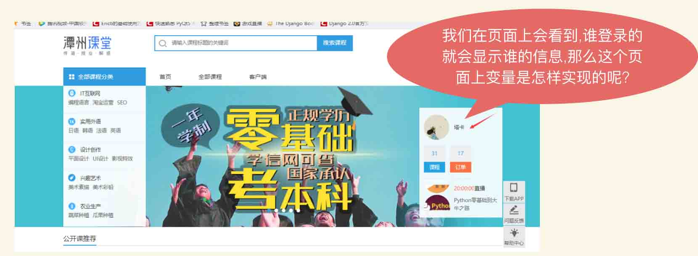

# 4.模板
## 4.1.模板存放目录与配置
### 4.1.1 模板存放目录
* 在主目录下创建一个templates目录用来存放所有的html的模板文件。
* templates目录里面在新建各个以app名字命名的目录来存放各个app中模板文件。
```
DjangoProject          #项目总目录
├── blog               #app目录
├── hello_django       #主程序目录
├── manage.py          #主程序
├── static             #静态目录
└── templates          #模板目录
    └── blog           #模板目录下各个app目录
        └── test.html  #模板文件
```

### 4.1.2 配置模板路径模块
* 在配置文件`setting.py`中找到TEMPLATES设置来配置。
* 这是一个设置选项的列表，模板大都包含两项通用设置；两种方式配置模板:
设置 `settling.py`中的模块路径配置
```
TEMPLATES = [
    {
        'BACKEND': 'django.template.backends.django.DjangoTemplates',
        'DIRS': [os.path.join(BASE_DIR,'templates')], #模板路径添加到DIRS中
        'APP_DIRS': True,      #第二种方法需要设置APP_DIRS为True
        'OPTIONS': {
            'context_processors': [
                'django.template.context_processors.debug',
                'django.template.context_processors.request',
                'django.contrib.auth.context_processors.auth',
                'django.contrib.messages.context_processors.messages',
            ],
        },
    },
]
```

**第一种:**

DIRS 定义一个目录列表，模板引擎按列表顺序搜索这些目录以查找模板源文件。将templates放在主项目目录下。
```
DjangoProject          #项目总目录
├── blog               #app目录
├── hello_django       #主程序目录
├── manage.py          #主程序
├── static             #静态目录
└── templates          #模板目录
    ├── book           #模板目录下各个app目录
    └── blog           #模板目录下各个app目录
        └── test.html  #模板文件
```

**第二种:**

APP_DIRS告诉模板引擎是否应该进入每个已安装的应用中查找模板,值为True则模板会去安装了的app下面的templates文件夹查找模板。所以也可以在每个app里面创建模板templates目录存放模板,这种方式需要将这个app添加到setting.py文件的INSTALLED_APPS列表中。
```
DjangoProject               #项目总目录
├── blog                    #app目录
│   ├── templates           #app目录下模板目录
│   │   └── blog_index.html #模板文件
├── hello_django            #主程序目录
│   ├── settings.py         #主程序配置文件
│   ├── urls.py             #主程序路由配置文件
│   ├── views.py            #主程序视图函数
│   └── wsgi.py             #web函数模块   
├── manage.py               #主程序文件
```
配置INSTALLED_APPS注册
```
INSTALLED_APPS = [
    'django.contrib.admin',
    'django.contrib.auth',
    'django.contrib.contenttypes',
    'django.contrib.sessions',
    'django.contrib.messages',
    'django.contrib.staticfiles',
    'blog',                        #第二种方法必须注册app才可以调用模板
]
```
### 4.1.3 渲染方法
**1. 直接将html字符串硬编码`HttpResponse`中**
```
from django.http import HttpResponse

def index(request):
    return HttpResponse('<h1> Hello Django World</h1>')
```
**2. Django.template.loader 定义了函数以加载模块**
```
from django.template.loader import get_template

def index1(request):
    t = get_template('blog/index.html')
    html = t.render({'blog_name':xx})
    return HttpResponse(html)
```
**3. 使用render模块渲染**
```
from django.shortcuts import render

def index2(request,xx):
    return render(request,'blog/index.html',{'booksname':xx})
```


-------------------------------------------------------------------------

## 4.2.变量
* 模板变量
* 常用的过滤器
* 静态文件引用

-------------------------------------------------------------------------

### 4.2.1.模板变量的引入



### 4.2.2.模板变量使用规则

1. 语法:   {{ 变量名 }}
2. 命名由字母和数字以及下划线组成，不能有空格和标点符号
3. 可以使用字典、模型、方法、函数、列表
4. 不要和python或django关键字重名
5. 变量和查找

**注:**

* 如果data是一个字典，那么访问data.items将会访问data这个字典的key名为items的值，而不会访问字典的items方法。
* 点在模板渲染时有特殊的含义。 变量名中点表示查找。 

### 4.2.3.模板变量例子

1. app blog/views.py文件
```
from django.shortcuts import render
from django.http import HttpResponse
from django.template.loader import get_template

def hello():
    return 'django'
class Fruits:
    def __init__(self,name, color):
        self.name = name
        self.colo = color
    def say(self):
        return 'HAHAHAHA'

ap = Fruits('apple','red')
ls = ['x','y','z']
dc = {'a':1,'b':2}

def index(request):
    return HttpResponse('<h1>这是blog主页<h1>')

def index1(request):
    t = get_template('blog/blog_index.html')
    html = t.render({'name':'taka'})
    return HttpResponse(html)

def index2(request):
    return render(request,'blog/blog_index.html',
                  context={
                      'name':'python',     # 字符串
                      'hello':hello,       # 函数
                      'fruits_say':ap.say, # 方法
                      'fruits':ap,         # 类对象
                      'list':ls,           # 列表
                      'dict':dc,           # 字典
                  })
```

2. /templates/blog/blog_index.html文件
```
<!DOCTYPE html>
<html lang="en">
<head>
    <meta charset="UTF-8">
    <title>Title</title>
</head>
<body>
这个变量是字符串对象 {{ name }}<br>
这个变量是函数对象 {{ hello }}<br>
这个变量是类对象 {{ fruits_say }}<br>
这个变量是类{{ fruits }} <br>
这个变量是列表对象 {{ list }} <br>
这个变量是字典对象 {{ dict }}<br>
</body>
</html>
```

-------------------------------------------------------------------------------
## 4.3.过滤器
### 4.3.1.语法
作用: 对变量进行过滤。在真正渲染出来之前，过滤器会根据功能处理好变量，然后得出结果后再替换掉原来的变量展示出来。

**语法：**`{{fruits|lower}}`

管道符号进行链式调用，比如实现一个功能，先把所有字符变成小写，把第一个字符转换成大写。

**语法：**`{{fruits|lower|capfirst}}`

使用参数:过滤器可以使用参数，在过滤器名称后面使用冒号”:”再加上参数，比如要把一个字符串中所有的空格去掉，则可以使用cut过滤器,

**语法如下:** `{{fruits|cut:" "}}`

**注意：**
使用参数的时候，冒号和参数之间不能有任何空格，一定要紧挨着。

### 4.3.2.常用过滤器

1. add:`字符串相加，数字相加，列表相加，如果失败，将会返回一个空字符串`
2. default:`提供一个默认值，在这个值被django认为是False的时候使用。`
3. first:`返回列表中的第一个值`
4. last:`返回列表中的最后一个值`
5. date:`格式化日期和时间`
6. time:`格式化时间`
7. join:`跟python中的join一样的用法`
8. length:`返回字符串或者是数组的长度`
9. length_is:`字符串或者是数组的长度是否是指定的值`
10. lower:`把所有字符串都变成小写`
11. truncatechars:`根据后面给的参数，截断字符，如果超过了用...表示`
12. truncatewords:`同truncatechars，而不会截断标签以上两个有x_html类似的，针对html，截断标签中的字符，而不会截断标签`
13. capfirst:`首字母大写`
14. slice:`切割列表。用法跟python中的切片操作是一样的，区间是前闭后开放`
15. striptags:`去掉所有的html标签`
16. safe:`关闭变量的自动转移`
17. floatformat:`浮点数格式化`

### 4.3.3.date和time过滤器格式

1. Y:`四位数的年` 如:`1999`
2. y:`两位数的年` 如:`99`
3. m:`两位数的月` 如:`01，09`
4. n:`一位数的月` 如:`1，9，12`
5. d:`两位数的日` 如:`01，09，31`
6. j:`一位数的日` 如:`1，9，31`
7. g:`12小时制的一位数的小时` 如:`1，9.12`
8. G:`24小时制的一位数的小时` 如:`0，8，23`
9. h:`12小时制的两位数的小时` 如:`01，09，12`
10. H:`12小时制的两位数的小时` 如:`01，13，24`
11. i:`分钟` 从00-59
12. s:`秒` 从00-59

### 4.3.4.过滤器的例子

在views.py文件内编辑如下代码
```
from django.shortcuts import render
from django.http import HttpResponse
from django.template.loader import get_template

def hello():
    return 'django'
class Fruits:
    def __init__(self,name, color):
        self.name = name
        self.colo = color
    def say(self):
        return 'HAHAHAHA'

ap = Fruits('apple','red')
ls = ['x','y','z']
dc = {'a':1,'b':2}

def index(request):
    return HttpResponse('<h1>这是blog主页<h1>')

def index1(request):
    t = get_template('blog/blog_index.html')
    html = t.render({'name':'taka'})
    return HttpResponse(html)

def index2(request):
    return render(request,'blog/blog_index.html',
                  context={
                      'name':'python',     # 字符串
                      'hello':hello,       # 函数
                      'fruits_say':ap.say, # 方法
                      'fruits':ap,         # 类对象
                      'list':ls,           # 列表
                      'dict':dc,           # 字典
                  })
```
在模板目录下创建一个test.html文件代码如下
```
<!DOCTYPE html>
<html lang="en">
<head>
    <meta charset="UTF-8">
    <title>Title</title>
</head>
<body>
这个变量是字符串对象 {{ name }}<br>
这个变量是函数对象 {{ hello }}<br>
这个变量是类对象 {{ fruits_say }}<br>
这个变量是类{{ fruits }} <br>
这个变量是列表对象 {{ list|last }} <br>
这个变量是字典对象 {{ dict }}<br>
</body>
</html>
```

## 4.4.关于自动转义
### 4.4.1.什么是自动转义

自动转义是将变量的一些特殊字符，比如左箭头（<）、右箭头（>）转义成html代码，这样做的目的是为了处理一些不安全的变量。

(<):转义成 (&lt);

(>): 转义成 (&gt);

(‘):转义成 (&#39);

(“):转义成 (&quot);

(&):转义成 (&amp);

-------------------------------------------------------------------------------

## 4.5. 静态目录与路径

### 4.5.1.静态文件`static`目录
在项目目录下创建`static`目录，为了区分开各种类型的文件分别创建`css`、`image`、`js`目录
```
DjangoProject     #项目总目录
├── blog          #app目录
├── hello_django  #主程序文件目录
├── manage.py     #django主程序
├── static        #静态目录
│   ├── css       #CSS样式目录
│   ├── image     #图片目录
│   └── js        #javescript目录
└── templates     #模板目录
```

### 4.5.2.静态文件配置
在`settings.py`文件中添加`STATICFILES_DIRS`

**设置静态文件目录路径，同templates。**
```
STATIC_URL = '/static/'

STATICFILES_DIRS = [
    os.path.join(BASE_DIR,'static')
]
```

### 4.5.3.创建静态文件
1. 创建文件/static/js/myjs.js
```
alert("哈哈哈");
```
2. 创建文件/static/css/mystyle.css
```
body{
  background:skyblue;
}
```
3. 创建文件/static/image/myimage.jpg

**存入图片到`image`目录下**

### 4.5.4.静态文件引用
创建模板`/templates/blog/test.html`文件，内如如下
```
 {# 加载static目录 #}
<!DOCTYPE html>
<html lang="en">
<head>
    <meta charset="UTF-8">
    <title>静态文件引用</title>
{#    <link rel="stylesheet" href="/static/css/mystyle.css"> 这个是普通引用 #}
    <link rel="stylesheet" href=""> {#Python引用样式 #}
</head>
<body>
<h1>测试网页</h1>
{##}
  {#Python引用图片 #}

{#<script src="/static/js/myjs.js"></script> 这个是普通引用 #}
<script src=""></script> {#Python引用js一般放在模板body后面 #}
</body>
</html>
```

-------------------------------------------------------------------------------

## 4.6 模板标签
### 4.6.1 模板标签概念
* **标签在渲染的过程中提供任意的逻辑**

这个定义是刻意模糊的。 

例如，一个标签可以输出内容，作为控制结构，例如“if”语句或“for”循环从数据库中提取内容，甚至可以访问其他的模板标签。

### 4.6.2 标签语法
* **标签语法: 来定义的。**

例如： 

-------------------------------------------------------------------------------
### 4.6.3 常用标签
**（1）** `if/elif/else`:可以使用and、or、in、not、==、!=、<=、>=，来进行判断。`ifequal/ifnotequal`:判断两个值是否相等

**（2）** `for ...in...`:跟python中的for...in...是一样的用法。
* `forloop.counter`:当前迭代的次数，下标从1开始。例:`1,2,3`
* `forloop.counter0`:当前迭代的次数，下标从0开始。例:`0,1,2`
* `forloop.revcounter`:当前迭代的次数，下标从大到小。例:`3,2,1`
* `forloop.revcounter0`:当前迭代的次数，下标从大到小。例:`2,1,0`
* `forloop.first`:返回bool类型，如果第一次迭代，返回True,否则返回Fase。
* `forloop.last`: 返回bool类型，如果是最后一次迭代，返回True,否则返回False。
* `forloop.parentloop`:如果发生多层for循环嵌套，那么这个变量返回的是上一层的for。

**（3）** `for ...in...empty...`:如果没有数据，跳转到empty中。

**（4）** `load`:加载第三方标签。最常用的是``

**（5）** `url`:返回一个明明的URL的绝对路径。

**（6）** `with`:缓存一个变量。

**（7）** `autoescape`:开启和关闭自动转义。 
### 4.6.4.模板标签例子
视图函数views.py文件代码如下
```
from django.shortcuts import render

ls = ['a','b','c']
dc = {'a':1,'b':2}
tp = 'x','y','z'

def tag_test(request):
    return render(request,'blog/tag_test.html',
                  context={'name':'python',
                           'list':ls,
                           'tuple':tp
                           })
```

创建一个模板文件tag_test.html文件存放在templates目录下
```
<!DOCTYPE html>
<html lang="en">
<head>
    <meta charset="UTF-8">
    <title>模板标签</title>
</head>
<body>

 #语法要求必须严格
    这是python课程


    这是django课程


    这是其他课程



</body>
</html>
```

app程序内urls.py文件内代码如下
```
from django.urls import path
from . import views

urlpatterns = [
    path('/tag_test',views.tag_test),
    ]
```

主程序urls.py文件代码如下
```
from django.urls import path, include
from .views import index

urlpatterns = [
    path('',index),
    path('blog',include('blog.urls')),#app路由
]
```
#### 4.6.4.1.if...elif...else
```
 #语法要求必须严格
    这是python课程


    这是django课程


    这是其他课程
```

#### 4.6.4.2.ifequal
```

    xxxxxxxxxxxxx

```

#### 4.6.4.3.for...in...
```
#以列表信息输出所有列表值

    <li>{{ i }}</li>

```

#### 4.6.4.4.forloop.counter
获取列表中的某一个值
```

    
        这是第二个值:{{ i }} <br>
    
        其他值:{{ i }}<br>

    

```
#### 4.6.4.5.forloop.counter0
```

    
        这是第二个值:{{ i }} <br>
    
        其他值:{{ i }}<br>

    

```
#### 4.6.4.6.forloop.revcounter
```

    
        这是第二个值:{{ i }} <br>
    
        其他值:{{ i }}<br>

    

```
#### 4.6.4.7.forloop.revcounter0
```

    
        这是第二个值:{{ i }} <br>
    
        其他值:{{ i }}<br>

    

```
#### 4.6.4.8.forloop.first
获取列表的第一个值
```

    
        这是第一个值:{{ i }} <br>
    
        其他值:{{ i }}<br>

    

```
#### 4.6.4.9.forloop.last
获取列表的最后一个值
```

    
        这是第一个值:{{ i }} <br>
    
        其他值:{{ i }}<br>

    

```
#### 4.6.4.10.forloop.parentloop
for嵌套循环
```

    
        
            {{ i }} {{ j }} <br>
        
            xxxxx<br>
        
    

```
#### 4.6.4.11.for...in...empty...
```
```
#### 4.6.4.12.load
第三方标签
```

```
#### 4.6.4.13.url 
页面跳转tag_test.html代码
```
<a href="">模板标签</a> #blog_index博客主页别名 age是参数
```
主路由表urls.py代码
```
from django.urls import path
from . import views
from django.urls import path, include

urlpatterns = [
    path('blog',include('blog.urls')),
]
```
分路由表urls.py代码
```
urlpatterns = [
    path('/index/<int:age>', views.index, name='blog_index'),
    path('/tag_test',views.tag_test),
    ]
```
blog主页模板index.html代码
```
<!DOCTYPE html>
<html lang="en">
<head>
    <meta charset="UTF-8">
    <title>博客主页</title>
</head>
<body>
这是博客主页
</body>
</html>
```
#### 4.6.4.14.with
模板tag_test.html代码
```
  #把一个变量重命名
 {{ mn }}

```
视图函数views.py文件代码如下
```
from django.shortcuts import render

def tag_test(request):
    return render(request,'blog/tag_test.html',
                  context={'name':'python'})
```
#### 4.6.4.15.autoescape
开启和关闭自动转义
```
原始:{{ html }}
<br>
过滤器:{{ html|safe }}
<br>
 #on关闭转义，off开启转义
    {{ html }}

```
视图函数views.py文件代码如下
```
def tag_test(request):
    html = '<h1> this is englisg</h1>'
    return render(request,'blog/tag_test.html',
                  context={'html':html})
```
#### 4.6.4.16注释方法
```
{# #} #大括号内两个#号中间的内容注释
```

-------------------------------------------------------------------------------

## 4.7 模板继承与引用

### 4.7.1.模板继承概念
Django模版引擎中最强大也是最复杂的部分就是模版继承了。 模版继承可以让你创建一个基本的“骨架”模版，它包含您站点中的全部元素，并且可以定义能够被子模版覆盖的blocks。

### 4.7.2.模板继承总结
**模板继承使用extends标签实现。通过使用block来给子模板开放接口。**
1. extends必须是模板中的第一个出现的标签。
2. 子模板中的所有内容，必须出现在父模板定义好的block中，否则django将不会渲染。
3. 如果出现重复代码，就应该考虑使用模板。
4. 尽可能多的定义block，方便子模板实现更细的需求。
5. 如果在某个block中，要使用父模板的内容，使用block.super获取。

### 4.7.3.模板继承实例
#### 4.7.3.1.继承模板base
创建base.html作为模板继承页代码如下
```
<!DOCTYPE html>
<html lang="en">
<head>
    <meta charset="UTF-8">
    <title>base模板</title>
</head>
<body>


    这里是头部信息

<br> <br> <br> <br>


    这是默认内容

<br> <br> <br> <br>

    这是尾部信息


</body>
</html>
```
创建indexxxx.html这个模板中实现继承和引用代码如下
```


继承模板标题 #这是标题信息

 {# 这里是继承模板替换的内容信息 #}
    这里是继承模板后替换的内容<br><br>
    通过block.super继承父类:{{ block.super }} <br><br>
    这是子模板自己的内容:没有写block就不会显示



    这是通过include引用的其他模板的内容:

```
创建ss.html这个模板的引用页代码如下
```
<!DOCTYPE html>
<html lang="en">
<head>
    <meta charset="UTF-8">
    <title>内容</title>
</head>
<body>
这是测试学习页面
</body>
</html>
```
分路由创建urls.py文件代码如下
```
from django.urls import path
from . import views

urlpatterns = [
    path('/index', views.index),
    ]
```
主路由创建urls.py文件代码如下
```
from django.urls import path, include

urlpatterns = [
    path('blog',include('blog.urls')),
]
```

-----------------------------------------------------------

## 4.8 自定义过滤器及标签
### 4.8.1.关于自定义
### 4.8.2.文件路径配置
### 4.8.3.自定义过滤器
### 4.8.4.自定义标签