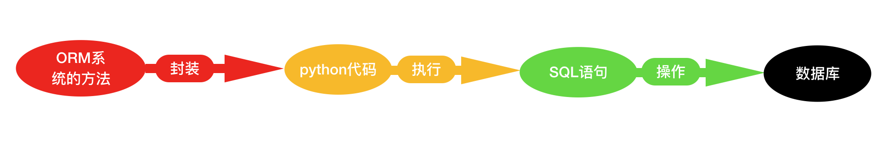
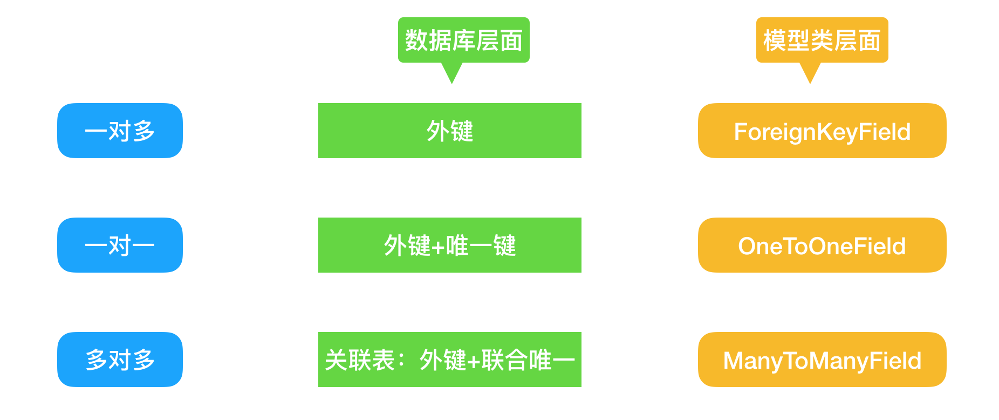

# 6.ORM
## 6.1.基础
* Django的ORM简介
* 数据库连接配置
* 模型的创建与映射
* 数据的增删改查
-----------------------------------------------------------
### ORM系统分析

* ORM概念:对象关系映射(Object Relational Mapping,简称ORM)
* ORM的优势:不用直接编写SQL代码，只需像操作对象一样从数据库操作数据
-----------------------------------------------------------
### 模型映射关系

* 模型类必须都写在app下的models.py文件中。
* 模型如果需要映射到数据库,所在的app必须被安装。
* 一个数据表对应一个模型类,表中的字段,对应模型中的类属性。
-----------------------------------------------------------
### 数据库的配置
在settings.py中配置DATABASES
```
DATABASES = {
    'default': {
        'ENGINE': 'django.db.backends.mysql', # 数据库引擎
        'NAME': 'mydb', # 数据库名称
        'USER': 'admin', # 链接数据库的用户名
        'PASSWORD': 'Root110qwe', # 链接数据库的密码
        'HOST': '127.0.0.1', # mysql服务器的域名和ip地址
        'PORT': '3306', # mysql的一个端口号,默认是3306
        }
    }
```
**1.数据库驱动安装**
* 在虚拟环境中安装`pymysql pip install pymysql`
* 在虚拟环境中安装`Pillow pip install Pillow`

**2.设置连接器为pymysql**

在主目录下的的__init__.py文件添加下面两句
```
import pymysql
pymysql.install_as_MySQLdb()
```

**3.使用Django中的数据模型**

在app下面的models.py中创建django模型类
```
from django.db import models #引入Django的数据模型

class User(models.Model):
        id = models.AutoField(primary_key=True) #主键可以省略，django会自动给我们加上
        name =models.CharField(max_length=30) #字符长度，默认必须写长度
        age = models.IntegerField() #IntegerFiled 整型

        #格式化输出
        def __str__(self):
        return 'Department<id=%s,name=%s,age=%s>'%(self.id,self.name,self.age)
```


**4.将模型类映射到数据库**
* 执行`python manage.py makemigrations`该命令，创建映射数据库文件。
* 执行`python manage.py migrate <appname>`该命令，提交到数据库。
-----------------------------------------------------------

### 启动项目报错
报以下错误
`Django2.2/mysql ImproperlyConfigured: mysqlclient 1.3.13 or newer is required you have 0.9.3`

**1.解决方法**

Django连接MySQL时默认使用MySQLdb驱动，但MySQLdb不支持Python3，因此这里将MySQL驱动设置为pymysql。

**2.仍使用django 2.2版本**
```
#找到Python环境下 django包，并进入到backends下的mysql文件夹
cd /opt/anaconda3/envs/envAGC_Mini/lib/python3.6/site-packages/django/db/backends/mysql
#文件列表如下

找到base.py文件，注释掉 base.py 中如下部分（35/36行）
if version < (1, 3, 3):
raise ImproperlyConfigured("mysqlclient 1.3.3 or newer is required; you have %s" % Database.__version__)
```

此时仍会会报错，报错信息如下

`AttributeError: ‘str’ object has no attribute ‘decode’`

**3.解决办法**
```
#找到operations.py文件（46行），将decode改为encode
#linux vim 查找快捷键：？decode
if query is not None:
    query = query.decode(errors='replace')
    return query
#改为
if query is not None:
    query = query.encode(errors='replace')
    return query
```
-----------------------------------------------------------
## 6.2.增删改查
创建views.py文件

### 简单增删改查
```
from django.http import HttpResponse
from .models import User

#增加数据
def add_user(request):
    #第一种方法
    taka = User(name='zlk', age = 18)
    taka.save()
    #第二种方法
    budong = User()
    budong.name = 'budong'
    budong.age = 18
    budong.save()
    #第三种方法
    User.objects.create(name='leva',age=18)
    #第四种方法 添加数据会判断数据是否存在，若存在不添加，不存在就添加
    User.objects.get_or_create(name='vip',age=19)

    return HttpResponse('数据添加成功')

#查询数据
def search_user(request):
    #查询所有记录
    rs =User.objects.all()
    #获取第一条数据
    rs =User.objects.first()
    #获取最后一条数据
    rs = User.objects.last()
    #根据参数提供的条件过滤后的记录
    rs = User.objects.filter(name='zlk',age=18)
    #注意：filter（**kwargs）方法：根据参数提供的提取条件，获取一个过滤后的QuerySet。
    print(rs[2]) #一个模型的实例，数据表的一条数据
    #查询某一个记录，返回一个对象
    rs = User.objects.get(id=3) #一个实例对象
    return HttpResponse('查询添加成功')

#更新数据
def update_user(request):
    #第一种方法
    rs = User.objects.get(id=3)
    rs.name = 'ali'
    rs.save()
    print(rs)
    #第二种更新
    User.objects.filter(name='ali').update(name='zlkvip')
    User.objects.all().update(city='beijing')

    return HttpResponse('数据更新成功')
#删除数据
def delete_user(request):
    User.objects.get(id=4).delete()
    #注意：get返回的对象具有唯一性质，如果符合条件的对象有多个，则get报错！
    return HttpResponse('数据删除成功')
```
### 常用查询方法
```
from django.http import HttpResponse
from .models import User

# 查询数据
def add_user(request):
    # 获取所有记录
    rs = User.objects.all()

    # 获取第一条数据
    rs = User.objects.first()

    # 获取最后一条数据
    rs = User.objects.last()

    # 根据参数提供的条件获取过滤后的记录
    rs = User.objects.filter(name='vip')
    # 注意：filter（**kwargs）方法：根据参数提供的提取条件，获取一个过滤后的QuerySet。

    # 排除name等于vip的记录
    rs = User.objects.exclude(name='vip')

    # 获取一个记录对象
    rs = User.objects.get(name='vip')
    # 注意：get返回的对象具有唯一性，如果符合条件的对象有多个，则get报错！

    # 对结果排序order_by
    rs = User.objects.order_by('age')

    # 多项排序
    rs = User.objects.order_by('age', 'id')

    # 逆向拍讯
    rs = User.objects.order_by('-age')
    # 将返回来的QuerySet中Model转换为字典

    # 获取所有值
    rs = User.objects.all().values()

    print(rs)

    return HttpResponse('数据添加成功')
```
### 常用查询条件
查找对象的条件的意思是传给以上方法的一些参数。相当于是SQL语句中的where语句后面的条件，语法为字段名__规则(是连着连个下划线哦)
```
from django.http import HttpResponse
from .models import User

def add_user(request):

# exact相当于等于号
    rs = User.objects.filter(name__exact='xiaoming')

# contains 包含
    rs = User.objects.filter(name__contains='xiao')

# startwith以什么开始,
    rs = User.objects.filter(name__startswith='xiao')

# istartswith 同 startswith相同方法，忽略大小写
    rs = User.objects.filter(name__istartswith='xiao')

# endswith 同 startswith相同用法，以什么结尾
    rs = User.objects.filter(name__endswith='o')

# iendswith 同 istartswith相同用法，以什么结尾，忽略大小写。
    rs = User.objects.filter(name__iendswith='o')

# in 成员所属
    rs = User.objects.filter(age__in=[18,19,20])

# gt大于
    rs = User.objects.filter(age__gt=19)

# gte大于等于
    rs = User.objects.filter(age__gte=19)

# lt小于
    rs = User.objects.filter(age__lt=19)

# lte 小于等于
    rs = User.objects.filter(age__lte=19)

# range 区间
    rs = User.objects.filter(age__range=(18, 20))

# isnull 判断是否为空
    rs = User.objects.filter(city__isnull=True)

return HttpResponse("查询所有信息")

```
### 常用的字段类型
1. IntegerField :整型，映射到数据库中的int类型。
2. CharField:字符类型，映射到数据库中的varchar类型，通过max_length指定最大长度。
3. TextField:文本类型，映射到数据库中的text类型。
4. BooleanField:布尔类型，映射到数据库中的tinyint类型，在使用的时候，传递True/False进去。如果要可以为空，则用NullBooleanField。
5. DateField:日期类型，没有时间。映射到数据库中是date类型，在使用的时候，可以设置DateField.auto_now每次保存对象时，自动设置该字段为当前时间。设置DateField.auto_now_add当对象第一次被创建时自动设置当前时间。
6. DateTimeField: 日期时间类型。映射到数据库中的是datetime类型，在使用的时候，传递datetime.datetime()进去。
### Field的常用参数
1. primary_key:指定是否为主键。
2. unique:指定是否唯一。
3. null:指定是否为空，默认为False。
4. blank:等于True时form表单验证时可以为空，默认为False。
5. default:设置默认值。
6. DateField.auto_now:每次修改都会将当前时间更新进去，只有调用，QuerySet.update方法将不会调用。这个参数只是Date和DateTime以及TimModel.save()方法才会调用e类才有的。
7. DateField.auto_now_add:第一次添加进去，都会将当前时间设置进去。以后修改，不会修改这个值
### 表关系实现

### 插入数据
```
from django.http import HttpResponse
from .models import Department,Student,Course,Stu_detail

def add_user(request):
    # .create()新建数据
    # 插入学院科目分类
    Department.objects.create(d_name='软件')
    Department.objects.create(d_name='设计')
    Department.objects.create(d_name='语言')
    Department.objects.create(d_name='艺术')
    Department.objects.create(d_name='综合')

    # 插入学生信息
    Student.objects.create(s_name='小明',department_id=1)
    Student.objects.create(s_name='小红',department_id=2)
    Student.objects.create(s_name='小花',department_id=3)
    Student.objects.create(s_name='小卡',department_id=4)
    Student.objects.create(s_name='小黑',department_id=5)

    # 插入课程信息
    Course.objects.create(c_name='Python')
    Course.objects.create(c_name='java')
    Course.objects.create(c_name='大数据')
    Course.objects.create(c_name='数据分析')
    Course.objects.create(c_name='养猪')
    Course.objects.create(c_name='摄影')
    return HttpResponse('数据添加成功')
```
### 一对多查询
```
from django.http import HttpResponse
from .models import Department,Student,Course,Stu_detail

def add_user(request):
    d1 = Department.objects.get(d_id=3) # 一个学院实例对象
    s1 = Student.objects.get(s_id=3)  # 一个学生实例对象
    print(s1.department.d_name)       # 学生所属学院的名称

    默认情况是student_set
    print(d1.student_set.all())        # 反向查询，学院的学生
    # 通过related_name重命名为students,为Student数据模型添加一个重命名related_name=students

    print(d1.students.all()) # 反向查询，学院的学生

    #为指定学生id插入一条学生详细信息
    Stu_detail.objects.create(age=18, gender=0, city='石家庄市', student_id=3)
    std = Stu_detail.objects.get(id=1) #实例化一个学生的详细信息
    print(std) #查询一个学生的详细信息

    return HttpResponse('数据查询成功')
```
### 一对一查询
```
from django.http import HttpResponse
from .models import Department,Student,Course,Stu_detail

def add_user(request):
    s1 = Student.objects.get(s_id=3) # 一个学生实例对象
    std = Stu_detail.objects.get(id=1) #实例化一个学生的详细信息
    print(std.student.s_name) #正向查询一个学生的名字
    print(s1.stu_detail) #反向查询，直接类名小写

    return HttpResponse('数据查询成功')
```
### 多对多查询
```
from django.http import HttpResponse
from .models import Department,Student,Course,Stu_detail

def add_user(request):
    s4 = Student.objects.get(s_id=4) # 一个学生实例对象
    c1 = Course.objects.get(c_id=1)  # 一个课程实例对象
    print(c1.student.all())  # 正向查询

    # print(s4.course_set.all()) # 反向查询默认是course_set
    # related_name指定名字courses,为Course数据模型添加一个重命名related_name=courses
    print(s4.courses.all()) 

    d3 = Department.objects.get(d_id=3)
    s3 = Student.objects.get(s_id=3)
    std = Stu_detail.objects.get(id=1)
    c1 = Course.objects.get(c_id=1)
    xh = Student.objects.get(s_id=2)
    print(d1,s1,std,c1,xh)
    return HttpResponse('数据查询成功')
```
### 一对多添加数据
```
from django.http import HttpResponse
from .models import Department,Student,Course,Stu_detail

def add_user(request):
    d3 = Department.objects.get(d_id=3) #查询科目d_id=3
    xh = Student.objects.get(s_id=2)
    一对多 数据的添加 .add() #添加已经存在的数据
    d3.students.add(xh)
    更新数据添加数据
    xiaohei = Student.objects.get(s_id=5)
    d3.students.add(xiaohei)

    新建数据 .create()
    d3.students.create(s_name='汪洋')
    d3.students.create(s_name='baidu')
    return HttpResponse('数据添加成功')
```
### 多对多添加数据
```
from django.http import HttpResponse
from .models import Department,Student,Course,Stu_detail

def add_user(request):
    c1 = Course.objects.get(c_id=1)
    c2 = Course.objects.get(c_id=2) #查询课程c_id=2的课程 实例化
    s3 = Student.objects.get(s_id=3) #查询s_id=3 的学生实例化
    s3.courses.add(c1,c2)  #多对多插入课程和科目
    s3.courses.create(c_name='php') #插入新的课程数据到s3学生
    return HttpResponse('数据添加成功')

```
### 多表查询
```
from django.http import HttpResponse
from .models import Department,Student,Course,Stu_detail

def add_user(request):
    # 查询学院名字为"语言"的学生信息
    rs = Student.objects.filter(department__d_name='语言')
    # 查询学生名字中包含'小'的学生的学院信息
    rs = Department.objects.filter(students__s_name__contains='小')
    # 查询学号为3的所有学生课程
    rs = Course.objects.filter(student__s_id=3)
    # 查询报了课程1的所有学生
    rs =Student.objects.filter(courses__c_id=1)
    #查询报了'python'课程的学生的所属学院的信息
    rs = Department.objects.filter(students__courses__c_name='python')
    print(rs)
    return HttpResponse('数据查询成功')
```
### 一对多.remove()删除
必须保证外键列允许为空
```
from django.http import HttpResponse
from .models import Department,Student,Course,Stu_detail

def add_user(request):
    xh = Student.objects.get(s_id=2)
    d3 = Department.objects.get(d_id=3) #查询科目d_id=3
    d3.students.remove(xh)
    return HttpResponse('数据删除成功')
```
### 多对多.remove()删除
删掉的是中间信息表信息
```
from django.http import HttpResponse
from .models import Department,Student,Course,Stu_detail

def add_user(request):
    c1 = Course.objects.get(c_id=1)
    c2 = Course.objects.get(c_id=2)
    d3 = Department.objects.get(d_id=3) #查询科目d_id=3
    s3 = Student.objects.get(s_id=3) #查询s_id=3 的学生实例化
    s3.courses.remove(c1,c2)
    print(s3.courses.all()) # 查看报的课程
    print(s3.courses.clear()) # 清空所有报的课程
    return HttpResponse('数据删除成功')
```
### on_delete级联删除

**on_delete=models.CASCADE在django模型内设置此属性**

删除主表信息的同时也会删除关联信息表信息。

`Department.objects.get(d_id=1).delete()`

**on_delete=models.SET_NULL, null=True在django模型内设置此属性**

删除主表信息，允许子表信息值为空，不删除子表信息。

`Department.objects.get(d_id=2).delete()`

-----------------------------------------------------------
## 6.3.聚合查询
**聚合函数 Count Avg Max Min Sum, F, Q**
```
from django.http import HttpResponse

from .models import User
from django.db.models import Count, Avg, Max, Min, Sum, F, Q
def add_user(request):
    # 求平均年龄
    rs = User.objects.all().aggregate(Avg ('age'))

    # 指定一个名字
    rs = User.objects.all().aggregate(average_age = Avg('age'))
    print(rs)

    # 指定一个名字
    # rs = User.objects.all().aggregate(average_age = Avg('age'))

    # 最大年龄
    rs1 = User.objects.all().aggregate(Max('age'))

    #最小年龄
    rs2 = User.objects.all().aggregate(Min('age'))

    #年龄综合
    rs3 = User.objects.all().aggregate(Sum('age'))
    print(rs1,rs2, rs3)

    # 分组查询
    # 每个学员有多少个学生
    Student.objects.filter(department__d_id__isnull=True).update(department_id=5) #更新数据
    rs =Student.objects.values('department')
    rs = Student.objects.values('department').annotate(count=Count('department')).values('department__d_name','count')


    #多对多分组查询
    #查询某个学员报了多少门课
    rs = Student.objects.all().annotate(count=Count('courses')).values('s_name', 'count')

    #某一门课程有多少学生报名
    rs = Course.objects.all().annotate(count=Count('student')).values('c_id','c_name','count')
    print(rs)

    #F查询：针对两个字段的值得比较
    rs = User.objects.all().update(age=F('age')+1)

    # &与 或 | 非 |~
    #| 或
    rs = User.objects.filter(Q(name='xiaoxia') | Q(name='xiaohua'))
    #~ 非
    rs = User.objects.filter(Q(name='xiaoxia') |~ Q(name='xiaohua'))
    #& 与
    rs = User.objects.filter(Q(name='xiaoxia') & Q(name='xiaohua'))
    print(rs)
    return HttpResponse('数据查询成功')

```

## 6.4.博客案例
博客小案例功能介绍
1. 主页index.html:`展示添加博客和博客列表的文字，实现页面跳转。`
2. 添加add.html:`输入文章标题，并将内容提交到数据库中。`
3. 列表页list.html:`将数据库中所有的博客展示到数据库中，点击文章标题可以查看文章的详情，附带编辑和删除功能。`
4. 详情页detail.html:`显示文章的标题基内容`

### 6.4.1.创建项目配置settings文件
#### 6.4.1.1.创建一个项目
1. 创建python项目Django项目环境并命名为`mysite`
2. 创建python虚拟环境方法:`mkvirtualenv mysite`
4. 启动python虚拟环境方法:`workon mysite`
5. 安装Django方法:`pip install django`
5. 在存放项目文件执行新建项目命令:`django-admin startproject mysite`
6. 进入项目存放目录使用命令运行:`python manage.py runserver 0.0.0.0:8000`
7. 使用命令创建app方法:`django-admin startapp blog`
8. 安装数据库驱动方法:`pip install pymysql`
9. 安装数据库显示方法:`pip install Pillow`

#### 6.4.1.2.设置setting文件
* ALLOWED_HOSTS:`ALLOWED_HOSTS = ['*']`
* INSTALLED_APP:`INSTALLED_APPS = ['blog',]`
* TEMPLATES:`TEMPLATES = [{'DIRS': [os.path.join(BASE_DIR, 'templates')],}]`
* PyMySQL连接器配置:
```
#在主目录下的的__init__.py文件添加下面两句
import pymysql
pymysql.install_as_MySQLdb()
```
* DATABASES:
```
DATABASES = {
    'default': {
        'ENGINE': 'django.db.backends.mysql', 
        'NAME': 'blog', 
        'USER': 'leva', 
        'PASSWORD': 'leva123', 
        'HOST': '127.0.0.1',
        'PORT': '3306', 
        }
    }
```
都配置好，以及项目中的url分配设置好。
#### 6.4.1.3.模板文件创建
创建index.html文件代码如下
```



    首页



    <tr>
        <td><a href="">添加文章</a></td>
        <td><a href="">文章列表</a></td>
    </tr>

```
创建base.html文件代码如下
```
<!DOCTYPE html>
<html lang="en">
<head>
    <meta charset="UTF-8">
    <title>

    </title>
</head>
<body>




</body>
</html>
```
创建add.html文件代码如下
```


    添加博客


    <h1>添加新文章</h1>
    <form action="" method="POST"> 
        标题<input type="text" autocomplete="off" id="title"
                 placeholder="请输入标题" name='title'> <br> <br><br>
        内容 <textarea name="content" id="content"
                     placeholder="请输入内容" cols="30" rows="10"></textarea>
        <button type="submit">发布博客</button>
    </form>
    <a href="">返回首页</a>

```
创建list.html文件代码如下
```


    文章列表



    <h1 style="margin-left: 100px">文章列表</h1>
    <table width="400px">
        <thead style="font-size:20px">
            <tr>
                <th>标题</th>
                <th>操作</th>
            </tr>
        </thead>
    <tbody>

    
        <tr>
            <th><a href="">{{ blog.title }}</a></th>
            <th><a href="">编辑</a> | <a href="">删除 </a></th>
        </tr>

    

    </tbody>
    </table>


```
创建detail.html文件代码如下
```


    文章详情


    <h1>{{ blog.title }}</h1>
    {{ blog.content }}

```
创建edit.html文件代码如下
```


    更新博客


    <h1>修改文章</h1>
    <form action="" method="POST"> 
        标题<input type="text" autocomplete="off" id="title"
                 placeholder="请输入标题" name='title' value="{{ blog.title }}"> <br> <br><br>
        内容 <textarea name="content" id="content"
                     placeholder="请输入内容" cols="30" rows="10">{{ blog.content }}</textarea>
        <button type="submit">更新博客</button>
    </form>


```
### 6.4.2.创建数据建模


-----------------------------------------------------------